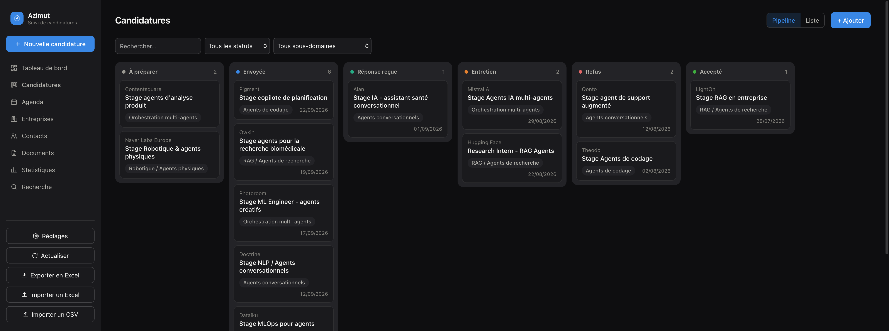

<p align="right"><a href="./README.md">English</a> | <b>Français</b></p>

<div align="center">
  

  <h1>Azimut</h1>

  <p><b>Suivi de ta recherche de stage dans une vraie base de données locale, derrière une appli de bureau native - pas un énième tableur.</b></p>

  <p>
    <a href="https://github.com/thmsgo18/azimut/actions/workflows/tests.yml"></a>
    <a href="LICENSE"></a>
    
  </p>

  <p>
    <a href="#installation">Installation</a> •
    <a href="#fonctionnalités">Fonctionnalités</a> •
    <a href="#ligne-de-commande--ia">CLI & IA</a> •
    <a href="#docs">Docs</a>
  </p>
</div>

---

Azimut centralise toute une recherche de stage - candidatures, entreprises, contacts, documents, entretiens - dans une seule base SQLite locale, derrière une interface soignée qui s'ouvre comme n'importe quelle application de bureau. Pensé au départ pour un M2 IA, il ne fait aucune hypothèse sur le domaine : il convient à n'importe quelle recherche de stage ou d'alternance.

Aucun compte, aucun cloud, aucun abonnement. Tout vit dans un seul fichier, sur ta machine.

<p align="center">
  
</p>

<table>
<tr>
<td width="50%"></td>
<td width="50%"></td>
</tr>
</table>

<p align="center">
  
</p>

<p align="center"><sub>Captures de l'application réelle, remplie de données de démonstration.</sub></p>

## Installation

Azimut s'installe en trois temps, quel que soit ton ordinateur : **1.** avoir Python, **2.** télécharger Azimut, **3.** double-cliquer sur le lanceur. Le premier lancement installe tout le reste tout seul. Il faut une connexion Internet cette fois-là uniquement, et compter 1 à 3 minutes.

Choisis ton système :

- [macOS](#macos) (MacBook, iMac, Mac mini…)
- [Windows](#windows) (Windows 10 ou 11)
- [Linux](#linux) (Ubuntu, Debian, Fedora, Arch…)

> **Où sont mes données ?** Toutes tes candidatures vivent dans un seul fichier, `suivi_candidatures.db`, créé dans le dossier d'Azimut au premier lancement. Rien n'est envoyé sur Internet. Pour tout désinstaller, supprime simplement le dossier.

### macOS

**Étape 1 - Vérifier que Python est là**

1. Ouvre le **Terminal** : appuie sur <kbd>⌘ Cmd</kbd> + <kbd>Espace</kbd>, tape `Terminal`, puis <kbd>Entrée</kbd>.
2. Dans la fenêtre qui s'ouvre, tape `python3 --version` puis <kbd>Entrée</kbd>.
   - S'il s'affiche `Python 3.9` ou plus (par exemple `Python 3.12.4`), c'est bon : passe à l'étape 2.
   - Si une fenêtre macOS propose d'**installer les outils de développement en ligne de commande**, clique sur **Installer**, accepte la licence et attends la fin (quelques minutes). Retape ensuite `python3 --version` pour vérifier.
   - Autre option : télécharge Python sur [python.org/downloads](https://www.python.org/downloads/). Clique sur le gros bouton jaune **Download Python 3.x**, ouvre le fichier `.pkg` depuis ton dossier **Téléchargements**, puis clique sur **Continuer** jusqu'à **Installer**.

Tu peux fermer le Terminal, on n'en a plus besoin.

**Étape 2 - Télécharger Azimut**

1. Clique sur [**ce lien pour télécharger le ZIP**](https://github.com/thmsgo18/azimut/archive/refs/heads/main.zip). Tu peux aussi aller sur [la page GitHub du projet](https://github.com/thmsgo18/azimut), cliquer sur le bouton vert **<> Code** puis sur **Download ZIP**.
2. Ouvre le **Finder**, puis le dossier **Téléchargements** dans la barre latérale.
   - Avec **Safari**, le ZIP est déjà décompressé : tu vois directement un dossier `azimut-main`.
   - Avec **Chrome** ou **Firefox**, double-clique sur `azimut-main.zip` pour obtenir le dossier `azimut-main`.
3. *(Conseillé)* Glisse le dossier `azimut-main` dans ton dossier **Documents** (ou ailleurs, mais pas dans la Corbeille). Tu peux le renommer `Azimut`.

**Étape 3 - Lancer Azimut**

1. Ouvre le dossier et double-clique sur **`Azimut.app`**, l'icône avec la boussole bleue.
2. **Au premier lancement, macOS bloque l'app**, car elle ne vient pas de l'App Store. C'est normal, et ça ne se fait qu'une fois :
   - **macOS 15 Sequoia et plus récent** : une fenêtre dit *« Azimut » n'a pas été ouvert*. Clique sur **Terminé**. Ouvre ensuite le menu  → **Réglages Système…** → **Confidentialité et sécurité**. Descends jusqu'à la section **Sécurité** : une ligne indique que l'ouverture d'« Azimut » a été bloquée. Clique sur **Ouvrir quand même**, confirme avec ton mot de passe ou Touch ID, puis clique sur **Ouvrir**.
   - **macOS 14 Sonoma et plus ancien** : fais un **clic droit** (ou <kbd>Ctrl</kbd> + clic) sur `Azimut.app`, choisis **Ouvrir**, puis clique sur **Ouvrir** dans la fenêtre d'avertissement.
3. **Patiente 1 à 3 minutes** : Azimut installe ce dont il a besoin. Rien ne s'affiche pendant ce temps, et l'icône peut sautiller dans le Dock. C'est normal.
4. La fenêtre Azimut s'ouvre. Au tout premier lancement, macOS te demande **où ranger tes documents** (CV, lettres, sauvegardes) : choisis un dossier, par exemple `Documents`, ou clique sur **Annuler** pour garder l'emplacement par défaut.

Les lancements suivants sont instantanés. **Astuce :** glisse `Azimut.app` dans ton **Dock** pour l'avoir sous la main. Le Dock garde un raccourci, l'app reste dans son dossier. Ne sors pas `Azimut.app` de son dossier : elle a besoin des fichiers qui l'entourent.

<details>
<summary><b>Ça ne marche pas sur Mac ?</b></summary>

- **Une fenêtre dit « Python 3 est introuvable »** : refais l'étape 1, puis relance `Azimut.app`.
- **Une fenêtre dit « Installation des dépendances impossible »** : vérifie ta connexion Internet, puis relance. Le détail de l'erreur se trouve dans le fichier `/tmp/azimut-install.log`.
- **Rien ne se passe du tout** : double-clique sur **`Azimut (terminal).command`**, dans le même dossier. Il fait la même chose mais affiche ce qui se passe dans une fenêtre Terminal, erreurs comprises.
- **macOS refuse encore d'ouvrir l'app** : ouvre le Terminal, tape `xattr -dr com.apple.quarantine ` (avec l'espace final), glisse le dossier d'Azimut dans la fenêtre du Terminal, puis appuie sur <kbd>Entrée</kbd>. Relance ensuite `Azimut.app`.

</details>

### Windows

**Étape 1 - Installer Python**

1. Va sur [python.org/downloads](https://www.python.org/downloads/) et clique sur le gros bouton jaune **Download Python 3.x**.
2. Ouvre le fichier téléchargé (`python-3.x.x-amd64.exe`), depuis la barre de téléchargements du navigateur ou le dossier **Téléchargements**.
3. **Important :** en bas de la toute première fenêtre, **coche la case « Add python.exe to PATH »**. Sans elle, Azimut ne trouvera pas Python.
4. Clique sur **Install Now**, accepte la demande d'autorisation de Windows, puis clique sur **Close** à la fin.

> Python est peut-être déjà là : ouvre le menu **Démarrer**, tape `cmd`, ouvre **Invite de commandes** et tape `py --version`. Si une version 3.9 ou plus s'affiche, passe à l'étape 2.

**Étape 2 - Télécharger Azimut**

1. Clique sur [**ce lien pour télécharger le ZIP**](https://github.com/thmsgo18/azimut/archive/refs/heads/main.zip). Tu peux aussi aller sur [la page GitHub](https://github.com/thmsgo18/azimut) → bouton vert **<> Code** → **Download ZIP**.
2. Ouvre l'**Explorateur de fichiers** (icône dossier jaune dans la barre des tâches, ou <kbd>⊞ Win</kbd> + <kbd>E</kbd>), puis **Téléchargements**.
3. **Fais un clic droit** sur `azimut-main.zip` → **Extraire tout…** → **Extraire**. Un dossier `azimut-main` apparaît. Ne lance pas Azimut depuis l'intérieur du ZIP, ça ne fonctionnerait pas.
4. *(Conseillé)* Déplace le dossier `azimut-main` dans **Documents**. Tu peux le renommer `Azimut`.

**Étape 3 - Lancer Azimut**

1. Ouvre le dossier et double-clique sur **`Azimut.bat`**. Si les extensions sont masquées, le fichier s'appelle juste `Azimut`, avec le type *Fichier de commandes Windows*.
2. Si un écran bleu **« Windows a protégé votre ordinateur »** apparaît, clique sur **Informations complémentaires**, puis sur **Exécuter quand même**. Ça n'arrive qu'une fois.
3. Une fenêtre noire s'ouvre et affiche *Première installation…* : **patiente 1 à 3 minutes** sans la fermer.
4. La fenêtre Azimut s'ouvre et la fenêtre noire se ferme d'elle-même.

**Astuce :** pour lancer Azimut depuis le Bureau, fais un clic droit sur `Azimut.bat` → **Afficher d'autres options** (Windows 11) → **Envoyer vers** → **Bureau (créer un raccourci)**.

<details>
<summary><b>Ça ne marche pas sous Windows ?</b></summary>

- **« Python 3 est introuvable »** : Python n'est pas installé, ou la case *Add python.exe to PATH* n'était pas cochée. Relance l'installateur de Python, choisis **Modify**, puis coche **Add Python to environment variables**. Ou désinstalle puis réinstalle Python en cochant la case.
- **« Installation impossible »** : vérifie ta connexion Internet, puis relance `Azimut.bat`.
- **La fenêtre Azimut reste blanche ou ne s'ouvre pas** : Azimut utilise le composant **Microsoft Edge WebView2**, présent par défaut sur Windows 10 et 11 à jour. S'il manque, installe-le depuis [la page WebView2 de Microsoft](https://developer.microsoft.com/fr-fr/microsoft-edge/webview2/) (**Evergreen Bootstrapper**), puis relance.

</details>

### Linux

Les commandes ci-dessous sont pour **Ubuntu / Debian**. Les équivalents Fedora et Arch sont juste en dessous.

**Étape 1 - Installer Python et la fenêtre native**

Ouvre un **Terminal** (<kbd>Ctrl</kbd> + <kbd>Alt</kbd> + <kbd>T</kbd> sur Ubuntu) et colle :

```bash
sudo apt update
sudo apt install python3 python3-venv python3-gi gir1.2-gtk-3.0 gir1.2-webkit2-4.1
```

Sur les versions plus anciennes (Ubuntu 22.04, Debian 11), remplace `gir1.2-webkit2-4.1` par `gir1.2-webkit2-4.0`.

- **Fedora** : `sudo dnf install python3 python3-gobject gtk3 webkit2gtk4.1`
- **Arch** : `sudo pacman -S python python-gobject webkit2gtk-4.1`

**Étape 2 - Télécharger Azimut**

Avec Git :

```bash
git clone https://github.com/thmsgo18/azimut.git ~/Azimut
```

Ou sans Git : [télécharge le ZIP](https://github.com/thmsgo18/azimut/archive/refs/heads/main.zip), puis dans ton gestionnaire de fichiers, clic droit sur `azimut-main.zip` → **Extraire ici**.

**Étape 3 - Lancer Azimut**

```bash
cd ~/Azimut          # ou le dossier azimut-main extrait
chmod +x azimut.sh   # une seule fois
./azimut.sh
```

Le premier lancement installe les dépendances (1 à 3 minutes), puis la fenêtre s'ouvre. Ensuite, `./azimut.sh` suffit. Certains gestionnaires de fichiers permettent aussi de double-cliquer dessus : choisis **Exécuter**.

<details>
<summary><b>Ça ne marche pas sous Linux ?</b></summary>

- **Erreur qui mentionne `GTK`, `WebKit` ou `gi`** : un paquet système de l'étape 1 manque. Installe-le, supprime le dossier `venv` créé par Azimut (`rm -rf venv`), puis relance `./azimut.sh`.
- **Solution de repli, qui marche partout** : utilise Azimut dans ton navigateur au lieu d'une fenêtre. Lance `./venv/bin/python serveur.py`, puis ouvre [http://localhost:8765](http://localhost:8765). C'est exactement la même interface.

</details>

### Mettre à jour Azimut sans perdre ses données

- **Avec Git** : dans le dossier d'Azimut, `git pull`, puis relance.
- **Avec le ZIP** : télécharge le nouveau ZIP et décompresse-le. Copie ton fichier **`suivi_candidatures.db`** de l'ancien dossier vers le nouveau, ainsi que les dossiers `documents` et `sauvegardes` si tu as gardé l'emplacement par défaut. Supprime ensuite l'ancien dossier. Au premier lancement, la nouvelle version met ta base à jour toute seule, et garde une copie de sécurité de l'ancienne.

## Fonctionnalités

- **Liste & pipeline kanban** - vue liste filtrable par défaut (statut modifiable en un clic, lien direct vers l'offre), ou kanban en glisser-déposer.
- **Entreprises & contacts** - liés à chaque candidature, avec une détection de doublons qui repère « Mistral » vs « Mistral AI ».
- **Tableau de bord & statistiques** - entonnoir, taux de réponse par source, courbe hebdomadaire, objectif hebdo.
- **Agenda** - vue mois/2 semaines, export vers Calendrier (Mac), Google Agenda, ou `.ics`.
- **Fiche de préparation d'entretien** et un mode entretien en écran partagé avec prise de notes en direct.
- **Saisie assistée par IA** (optionnelle, tout fournisseur) - colle une offre, le formulaire se pré-remplit. Rien n'est écrit sans ta confirmation.
- **Export/import Excel**, import CSV depuis LinkedIn/Indeed, sauvegardes automatiques.
- **100 % local** - rien ne quitte ta machine, sauf export explicite ou activation de l'assistant IA.

Quelques extras (app Rappels, vue compagnon iPhone) sont propres à macOS et détaillés dans [la doc complète](#docs).

## Ligne de commande & IA

Toutes les fonctions restent pilotables en ligne de commande :

```bash
./suivi candidatures ajouter --entreprise "AgentikCo" --poste "Stage agents IA" --statut Envoyée
./suivi candidatures lister --statut Envoyée
```

Azimut fournit aussi tout ce dont une IA a besoin pour tenir la base à jour directement et sans risque - champs validés, doublons détectés, jamais de SQL brut. Voir [`CLAUDE.md`](CLAUDE.md) et [`AGENT.md`](AGENT.md).

## Docs

Le guide complet - référence CLI intégrale, API Python, automatisations macOS, comparatif avec un tableur, et les valeurs autorisées de chaque champ - vit dans [`README.full.fr.md`](docs/README.full.fr.md).

## Tests

```bash
./venv/bin/python -m unittest discover -s tests
```

## Contribuer

Signalements de bugs, corrections, traductions et nouvelles fonctionnalités bienvenus, voir [`CONTRIBUTING.md`](CONTRIBUTING.md).

## Sécurité

Un problème de sécurité à signaler ? Voir [`SECURITY.md`](SECURITY.md) pour savoir comment procéder.

## Licence

[MIT](LICENSE) - projet personnel, ouvert et librement réutilisable.
