<p align="right"><a href="./README.md">English</a> | <b>Français</b></p>

<div align="center">
  

  <h1>Azimut</h1>

  <p><b>Suivi de ta recherche de stage dans une vraie base de données locale, derrière une appli de bureau native - pas un énième tableur.</b></p>

  <p>
    <a href="https://github.com/thmsgo18/Azimut/actions/workflows/tests.yml"></a>
    <a href="LICENSE"></a>
    
  </p>

  <p>
    <a href="#installation">Installation</a> •
    <a href="#fonctionnalités">Fonctionnalités</a> •
    <a href="#les-skills-ia-à-télécharger">Skills IA</a> •
    <a href="#ligne-de-commande--ia">CLI & IA</a> •
    <a href="#docs">Docs</a>
  </p>
</div>

---

Azimut centralise toute une recherche de stage - candidatures, entreprises, lettres de motivation, fiches et notes d'entretien, documents - dans une seule base SQLite locale, derrière une interface soignée qui s'ouvre comme n'importe quelle application de bureau. Pensé au départ pour un M2 IA, il ne fait aucune hypothèse sur le domaine : il convient à n'importe quelle recherche de stage ou d'alternance.

Aucun compte, aucun cloud, aucun abonnement. Tout vit dans un seul fichier, sur ta machine.

<p align="center">
  
</p>

<table>
<tr>
<td width="50%"></td>
<td width="50%">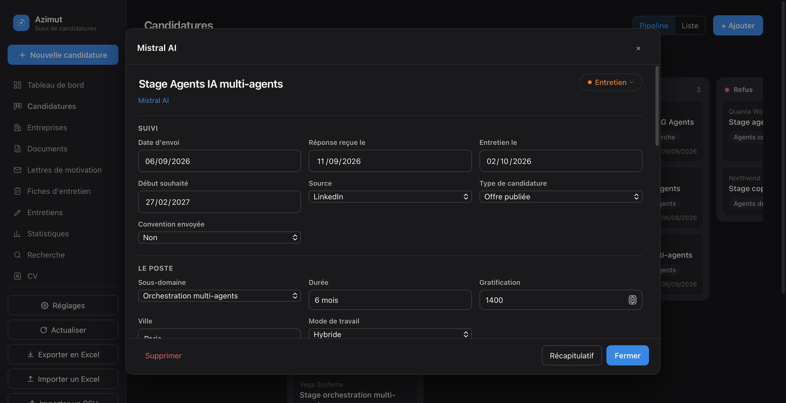</td>
</tr>
</table>

<p align="center">
  
</p>

<table>
<tr>
<td width="50%">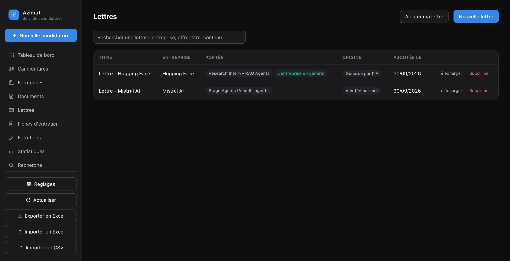</td>
<td width="50%">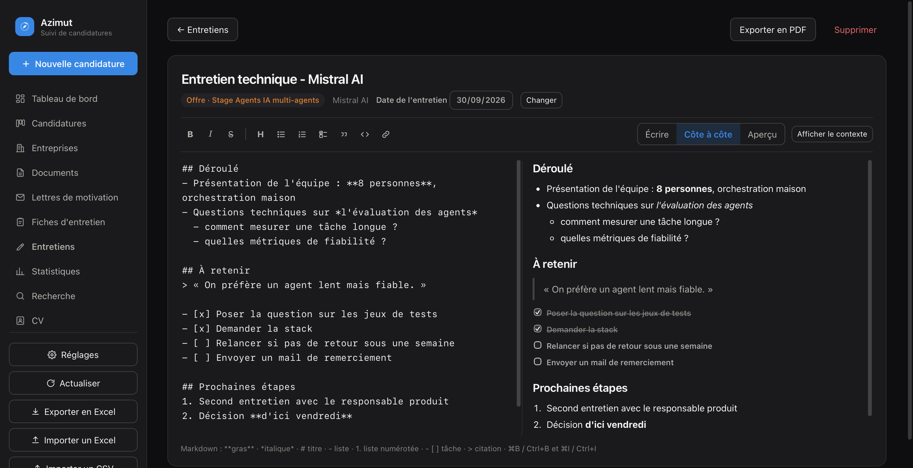</td>
</tr>
<tr>
<td width="50%">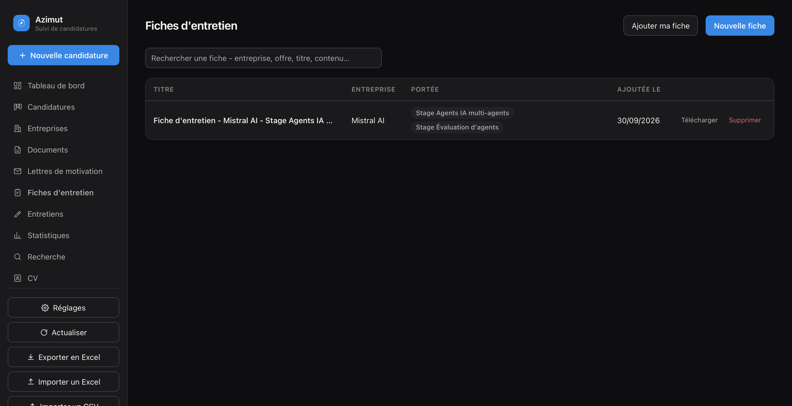</td>
<td width="50%">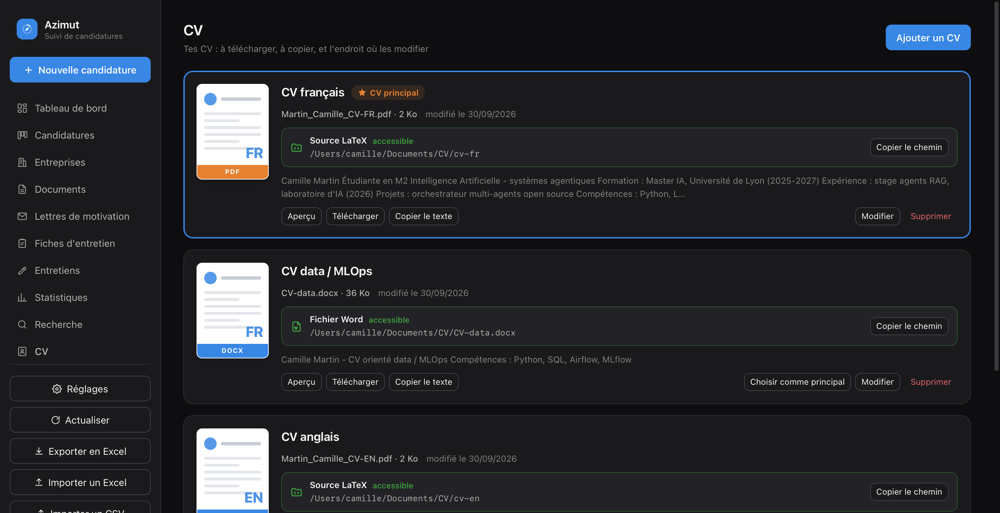</td>
</tr>
</table>

<p align="center"><sub>Captures de l'application réelle, remplie de données de démonstration.</sub></p>

## Installation

Azimut s'installe en trois temps, quel que soit ton ordinateur : **1.** avoir Python, **2.** télécharger Azimut, **3.** double-cliquer sur le lanceur. Le premier lancement installe tout le reste tout seul. Il faut une connexion Internet cette fois-là uniquement, et compter 1 à 3 minutes.

Choisis ton système :

- [macOS](#macos) (MacBook, iMac, Mac mini…)
- [Windows](#windows) (Windows 10 ou 11)
- [Linux](#linux) (Ubuntu, Debian, Fedora, Arch…)

> **Où sont mes données ?** Toutes tes candidatures vivent dans un seul fichier, `suivi_candidatures.db`, créé dans le dossier d'Azimut au premier lancement. Rien n'est envoyé sur Internet. Pour tout désinstaller, supprime simplement le dossier.

### macOS

**Étape 1 - Vérifier que Python est là**

1. Ouvre le **Terminal** : appuie sur <kbd>⌘ Cmd</kbd> + <kbd>Espace</kbd>, tape `Terminal`, puis <kbd>Entrée</kbd>.
2. Dans la fenêtre qui s'ouvre, tape `python3 --version` puis <kbd>Entrée</kbd>.
   - S'il s'affiche `Python 3.9` ou plus (par exemple `Python 3.12.4`), c'est bon : passe à l'étape 2.
   - Si une fenêtre macOS propose d'**installer les outils de développement en ligne de commande**, clique sur **Installer**, accepte la licence et attends la fin (quelques minutes). Retape ensuite `python3 --version` pour vérifier.
   - Autre option : télécharge Python sur [python.org/downloads](https://www.python.org/downloads/). Clique sur le gros bouton jaune **Download Python 3.x**, ouvre le fichier `.pkg` depuis ton dossier **Téléchargements**, puis clique sur **Continuer** jusqu'à **Installer**.

Tu peux fermer le Terminal, on n'en a plus besoin.

**Étape 2 - Télécharger Azimut**

1. Clique sur [**ce lien pour télécharger le ZIP**](https://github.com/thmsgo18/Azimut/archive/refs/heads/main.zip). Tu peux aussi aller sur [la page GitHub du projet](https://github.com/thmsgo18/Azimut), cliquer sur le bouton vert **<> Code** puis sur **Download ZIP**.
2. Ouvre le **Finder**, puis le dossier **Téléchargements** dans la barre latérale.
   - Avec **Safari**, le ZIP est déjà décompressé : tu vois directement un dossier `Azimut-main`.
   - Avec **Chrome** ou **Firefox**, double-clique sur `Azimut-main.zip` pour obtenir le dossier `Azimut-main`.
3. *(Conseillé)* Glisse le dossier `Azimut-main` dans ton dossier **Documents** (ou ailleurs, mais pas dans la Corbeille). Tu peux le renommer `Azimut`.

**Étape 3 - Lancer Azimut**

1. Ouvre le dossier et double-clique sur **`Azimut.app`**, l'icône avec la boussole bleue.
2. **Au premier lancement, macOS bloque l'app**, car elle ne vient pas de l'App Store. C'est normal, et ça ne se fait qu'une fois :
   - **macOS 15 Sequoia et plus récent** : une fenêtre dit *« Azimut » n'a pas été ouvert*. Clique sur **Terminé**. Ouvre ensuite le menu  → **Réglages Système…** → **Confidentialité et sécurité**. Descends jusqu'à la section **Sécurité** : une ligne indique que l'ouverture d'« Azimut » a été bloquée. Clique sur **Ouvrir quand même**, confirme avec ton mot de passe ou Touch ID, puis clique sur **Ouvrir**.
   - **macOS 14 Sonoma et plus ancien** : fais un **clic droit** (ou <kbd>Ctrl</kbd> + clic) sur `Azimut.app`, choisis **Ouvrir**, puis clique sur **Ouvrir** dans la fenêtre d'avertissement.
3. **Patiente 1 à 3 minutes** : Azimut installe ce dont il a besoin. Rien ne s'affiche pendant ce temps, et l'icône peut sautiller dans le Dock. C'est normal.
4. La fenêtre Azimut s'ouvre. Au tout premier lancement, macOS te demande **où ranger tes documents** (CV, lettres, sauvegardes) : choisis un dossier, par exemple `Documents`, ou clique sur **Annuler** pour garder l'emplacement par défaut.

Les lancements suivants sont instantanés. **Astuce :** glisse `Azimut.app` dans ton **Dock** pour l'avoir sous la main. Le Dock garde un raccourci, l'app reste dans son dossier. Ne sors pas `Azimut.app` de son dossier : elle a besoin des fichiers qui l'entourent.

<details>
<summary><b>Ça ne marche pas sur Mac ?</b></summary>

- **Une fenêtre dit « Python 3 est introuvable »** : refais l'étape 1, puis relance `Azimut.app`.
- **Une fenêtre dit « Installation des dépendances impossible »** : vérifie ta connexion Internet, puis relance. Le détail de l'erreur se trouve dans le fichier `/tmp/azimut-install.log`.
- **Rien ne se passe du tout** : double-clique sur **`Azimut (terminal).command`**, dans le même dossier. Il fait la même chose mais affiche ce qui se passe dans une fenêtre Terminal, erreurs comprises.
- **macOS refuse encore d'ouvrir l'app** : ouvre le Terminal, tape `xattr -dr com.apple.quarantine ` (avec l'espace final), glisse le dossier d'Azimut dans la fenêtre du Terminal, puis appuie sur <kbd>Entrée</kbd>. Relance ensuite `Azimut.app`.

</details>

### Windows

**Étape 1 - Installer Python**

1. Va sur [python.org/downloads](https://www.python.org/downloads/) et clique sur le gros bouton jaune **Download Python 3.x**.
2. Ouvre le fichier téléchargé (`python-3.x.x-amd64.exe`), depuis la barre de téléchargements du navigateur ou le dossier **Téléchargements**.
3. **Important :** en bas de la toute première fenêtre, **coche la case « Add python.exe to PATH »**. Sans elle, Azimut ne trouvera pas Python.
4. Clique sur **Install Now**, accepte la demande d'autorisation de Windows, puis clique sur **Close** à la fin.

> Python est peut-être déjà là : ouvre le menu **Démarrer**, tape `cmd`, ouvre **Invite de commandes** et tape `py --version`. Si une version 3.9 ou plus s'affiche, passe à l'étape 2.

**Étape 2 - Télécharger Azimut**

1. Clique sur [**ce lien pour télécharger le ZIP**](https://github.com/thmsgo18/Azimut/archive/refs/heads/main.zip). Tu peux aussi aller sur [la page GitHub](https://github.com/thmsgo18/Azimut) → bouton vert **<> Code** → **Download ZIP**.
2. Ouvre l'**Explorateur de fichiers** (icône dossier jaune dans la barre des tâches, ou <kbd>⊞ Win</kbd> + <kbd>E</kbd>), puis **Téléchargements**.
3. **Fais un clic droit** sur `Azimut-main.zip` → **Extraire tout…** → **Extraire**. Un dossier `Azimut-main` apparaît. Ne lance pas Azimut depuis l'intérieur du ZIP, ça ne fonctionnerait pas.
4. *(Conseillé)* Déplace le dossier `Azimut-main` dans **Documents**. Tu peux le renommer `Azimut`.

**Étape 3 - Lancer Azimut**

1. Ouvre le dossier et double-clique sur **`Azimut.bat`**. Si les extensions sont masquées, le fichier s'appelle juste `Azimut`, avec le type *Fichier de commandes Windows*.
2. Si un écran bleu **« Windows a protégé votre ordinateur »** apparaît, clique sur **Informations complémentaires**, puis sur **Exécuter quand même**. Ça n'arrive qu'une fois.
3. Une fenêtre noire s'ouvre et affiche *Première installation…* : **patiente 1 à 3 minutes** sans la fermer.
4. La fenêtre Azimut s'ouvre et la fenêtre noire se ferme d'elle-même.

**Astuce :** pour lancer Azimut depuis le Bureau, fais un clic droit sur `Azimut.bat` → **Afficher d'autres options** (Windows 11) → **Envoyer vers** → **Bureau (créer un raccourci)**.

<details>
<summary><b>Ça ne marche pas sous Windows ?</b></summary>

- **« Python 3 est introuvable »** : Python n'est pas installé, ou la case *Add python.exe to PATH* n'était pas cochée. Relance l'installateur de Python, choisis **Modify**, puis coche **Add Python to environment variables**. Ou désinstalle puis réinstalle Python en cochant la case.
- **« Installation impossible »** : vérifie ta connexion Internet, puis relance `Azimut.bat`.
- **La fenêtre Azimut reste blanche ou ne s'ouvre pas** : Azimut utilise le composant **Microsoft Edge WebView2**, présent par défaut sur Windows 10 et 11 à jour. S'il manque, installe-le depuis [la page WebView2 de Microsoft](https://developer.microsoft.com/fr-fr/microsoft-edge/webview2/) (**Evergreen Bootstrapper**), puis relance.

</details>

### Linux

Les commandes ci-dessous sont pour **Ubuntu / Debian**. Les équivalents Fedora et Arch sont juste en dessous.

**Étape 1 - Installer Python et la fenêtre native**

Ouvre un **Terminal** (<kbd>Ctrl</kbd> + <kbd>Alt</kbd> + <kbd>T</kbd> sur Ubuntu) et colle :

```bash
sudo apt update
sudo apt install python3 python3-venv python3-gi gir1.2-gtk-3.0 gir1.2-webkit2-4.1
```

Sur les versions plus anciennes (Ubuntu 22.04, Debian 11), remplace `gir1.2-webkit2-4.1` par `gir1.2-webkit2-4.0`.

- **Fedora** : `sudo dnf install python3 python3-gobject gtk3 webkit2gtk4.1`
- **Arch** : `sudo pacman -S python python-gobject webkit2gtk-4.1`

**Étape 2 - Télécharger Azimut**

Avec Git :

```bash
git clone https://github.com/thmsgo18/Azimut.git ~/Azimut
```

Ou sans Git : [télécharge le ZIP](https://github.com/thmsgo18/Azimut/archive/refs/heads/main.zip), puis dans ton gestionnaire de fichiers, clic droit sur `Azimut-main.zip` → **Extraire ici**.

**Étape 3 - Lancer Azimut**

```bash
cd ~/Azimut          # ou le dossier Azimut-main extrait
chmod +x azimut.sh   # une seule fois
./azimut.sh
```

Le premier lancement installe les dépendances (1 à 3 minutes), puis la fenêtre s'ouvre. Ensuite, `./azimut.sh` suffit. Certains gestionnaires de fichiers permettent aussi de double-cliquer dessus : choisis **Exécuter**.

<details>
<summary><b>Ça ne marche pas sous Linux ?</b></summary>

- **Erreur qui mentionne `GTK`, `WebKit` ou `gi`** : un paquet système de l'étape 1 manque. Installe-le, supprime le dossier `venv` créé par Azimut (`rm -rf venv`), puis relance `./azimut.sh`.
- **Solution de repli, qui marche partout** : utilise Azimut dans ton navigateur au lieu d'une fenêtre. Lance `./venv/bin/python serveur.py`, puis ouvre [http://localhost:8765](http://localhost:8765). C'est exactement la même interface.

</details>

### Mettre à jour Azimut sans perdre ses données

- **Avec Git** : dans le dossier d'Azimut, `git pull`, puis relance.
- **Avec le ZIP** : télécharge le nouveau ZIP et décompresse-le. Le plus simple pour emporter tes données : dans l'ancienne version, **Réglages → Sauvegarde complète → Créer**, puis **Restaurer** dans la nouvelle (voir plus bas). Ou copie ton fichier **`suivi_candidatures.db`** de l'ancien dossier vers le nouveau, ainsi que les dossiers `documents`, `lettres`, `fiches`, `cv`, `profil` et `sauvegardes` si tu as gardé l'emplacement par défaut. Supprime ensuite l'ancien dossier. Au premier lancement, la nouvelle version met ta base à jour toute seule, et garde une copie de sécurité de l'ancienne.

## Fonctionnalités

### Suivre ses candidatures

Une candidature, c'est **une offre chez une entreprise**. Elle avance dans un cycle simple, et tout ce qui la concerne - dates, liens, documents, lettres, fiches, notes - reste rattaché à elle.

| Statut | Ce que ça veut dire |
| :--- | :--- |
| **À préparer** | L'offre est repérée, rien n'est encore parti (brouillon, capture rapide, offre à traiter) |
| **Envoyée** | La candidature est partie |
| **Réponse reçue** | L'entreprise a répondu (accusé de réception, test technique, prise de contact) |
| **Entretien** | Un entretien est planifié ou a eu lieu |
| **Refus** / **Accepté** | Le point final |

- **Deux vues.** La **liste** (filtrable, avec un bouton « Voir l'offre » et le statut modifiable en un clic sur sa pastille) et le **pipeline** kanban : glisse une carte d'une colonne à l'autre pour changer son statut.
- **Un clic sur une offre ouvre sa fenêtre - et tout s'y modifie sur place.** Plus de bouton « Modifier » à presser d'abord : date d'envoi, réponse reçue le, entretien le, début souhaité, source, statut, durée, gratification, ville, mode de travail, liens, texte de l'offre, notes… Chaque changement est enregistré tout de suite (un texte, un instant après la dernière frappe), et un « Enregistré » discret le confirme.

<p align="center"></p>

- **Sous les champs :** la **préparation** (les documents, lettres, fiches et notes liés à cette offre, à rouvrir en un clic) et l'**historique** - une chronologie horodatée, tenue toute seule : création, changement de statut, réponse reçue, entretien planifié.

<p align="center">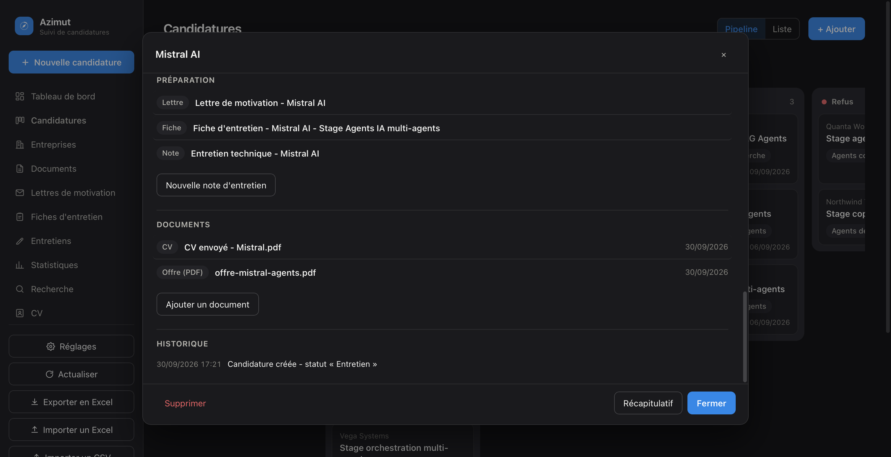</p>

**Un exemple, de l'offre à la réponse**

1. Tu repères une offre chez Mistral AI : **Nouvelle candidature**. Colle le texte de l'offre (avec une clé API, le formulaire se pré-remplit ; sinon, remplis-le). L'entreprise est créée toute seule, et un doublon est signalé avant d'être créé.
2. Tu envoies ta candidature : passe-la en **Envoyée** (pastille de statut, ou glisse la carte dans le pipeline). La date d'envoi et l'historique se remplissent.
3. Mistral répond : dans la fenêtre de l'offre, renseigne **Réponse reçue le**, passe le statut en **Réponse reçue**, puis en **Entretien** avec la **date d'entretien** : elle apparaît dans « Entretiens à venir » du tableau de bord.
4. Tu prépares l'entretien : une **fiche d'entretien** pour l'offre, tes **notes** pendant l'échange (voir plus bas), le **CV** et la **lettre** envoyés rangés dans les **documents** de l'offre.
5. La réponse tombe : **Accepté** ou **Refus**. Les statistiques (entonnoir, délais, taux de réponse par source) se mettent à jour.

**Autour des candidatures :** détection de doublons (un doublon exact est refusé, un intitulé proche est signalé), détection des **liens d'offres morts**, comparateur d'offres côte à côte, import CSV (LinkedIn, Indeed…) et Excel, objectif hebdomadaire, tableau de bord et statistiques.

### Entreprises et documents

- **Entreprises** - créées automatiquement avec les candidatures, avec un contexte (actus, missions, équipe) et une détection de doublons qui repère « Mistral » vs « Mistral AI ». Ouvre une entreprise : ses candidatures, documents, lettres, fiches et notes sont réunis, et son nom, son site ou son contexte se modifient directement, sans bouton « Modifier ».
- **Documents** - n'importe quel fichier (offre en PDF, CV et lettre envoyés, portfolio, scan…), conservé tel quel. Comme pour les lettres, on choisit **une entreprise** et **une ou plusieurs de ses offres** (ou l'entreprise en général) avec la même barre de recherche, et on peut en déposer **plusieurs d'un coup**. Un clic ouvre l'**aperçu dans une fenêtre** (PDF, image, texte) - jamais en plein écran - et leur texte est retrouvé par la recherche globale.

<p align="center">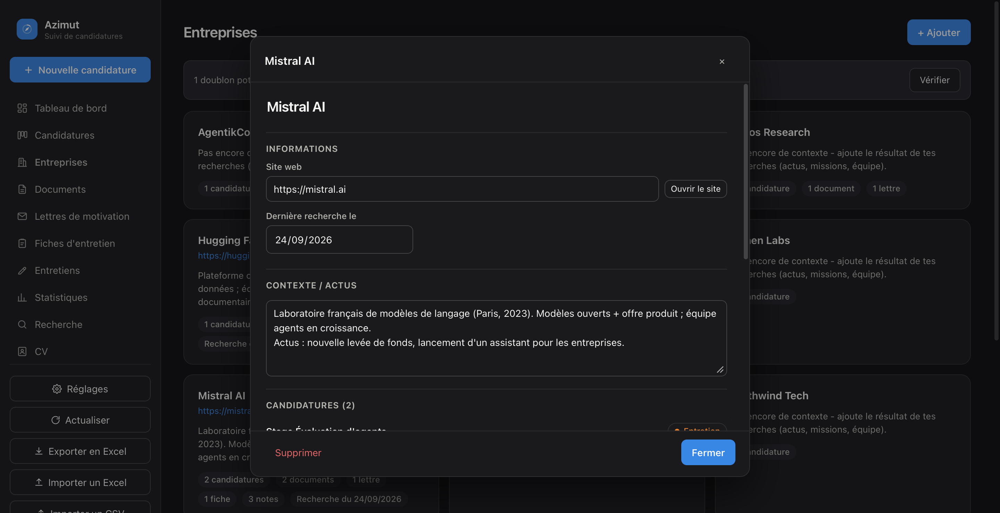</p>

<p align="center">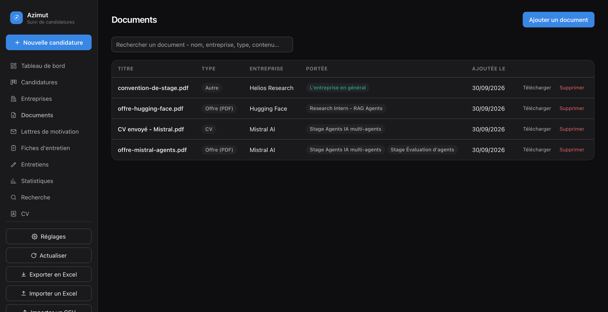</p>

### Lettres de motivation

Trois façons d'en avoir une :

1. **Avec l'IA d'Azimut** (clé API) : elle lit ton CV et l'offre, fait une recherche sur l'entreprise, et enregistre la lettre (texte + PDF).
2. **Avec une IA installée sur ton ordinateur** (Claude Code ou autre), **sans clé API** : ouvre le dossier d'Azimut avec elle et demande la lettre. Elle suit le guide [`skills/lettre-motivation/AGENT.md`](skills/lettre-motivation/AGENT.md) et enregistre le résultat au bon endroit - voir [les skills](#les-skills-ia-à-télécharger).
3. **Ajouter la tienne** : glisse-dépose un PDF, un Word ou un texte, ou cherche-le dans tes fichiers. Il est conservé tel quel.

Le formulaire est le même dans les trois cas : une **barre de recherche** sur les entreprises *et* les offres, **une seule entreprise** mais **plusieurs offres** cochables, et « aussi sur l'entreprise en général » pour une lettre qui ne vise pas qu'un poste.

<table>
<tr>
<td width="50%">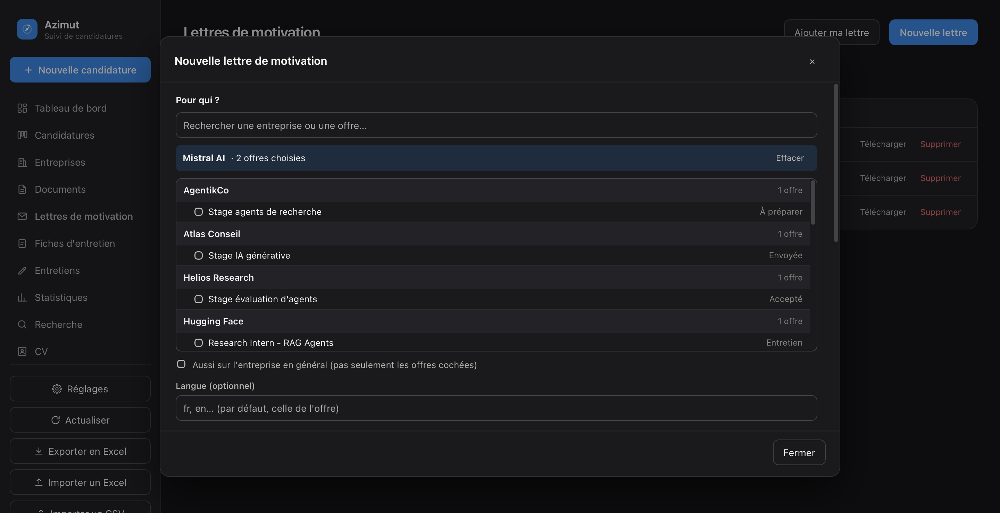</td>
<td width="50%">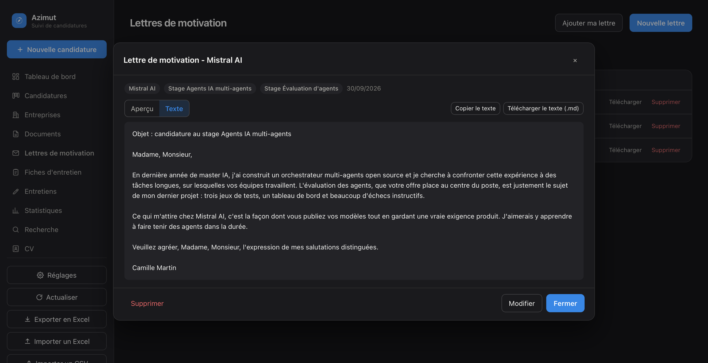</td>
</tr>
</table>

Un clic sur une lettre l'ouvre dans une fenêtre, avec deux onglets : **Aperçu** (le PDF) et **Texte** (à copier ou à télécharger en `.md`).

### Fiches d'entretien

Une fiche prépare un entretien pour **une ou plusieurs offres d'une même entreprise** : présentation de l'entreprise (chiffres clés, clients, sources), détail de chaque poste (accroche, stack, missions), **questions à poser** adaptées à ton profil, et le lien de l'offre - seulement s'il répond encore. Comme les lettres, elle se génère avec l'IA d'Azimut, se demande à une IA installée sur ton ordinateur (guide [`skills/fiche-entretien/AGENT.md`](skills/fiche-entretien/AGENT.md), sans clé API), ou s'ajoute telle quelle. Le PDF est fabriqué par Azimut lui-même : le même sur macOS, Windows et Linux.

<p align="center">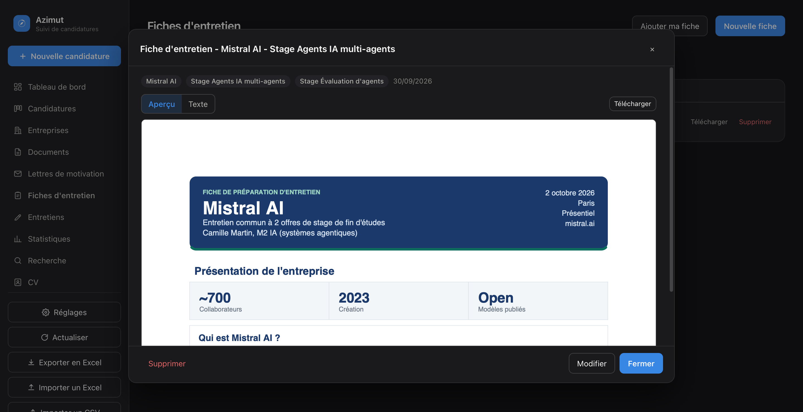</p>

### Notes d'entretien

Une vraie prise de notes, sur **une entreprise ou une offre précise**, en **Markdown avec rendu en direct** : écris à gauche, le résultat s'affiche à droite. Gras, italique, titres, listes à puces ou numérotées (qui se poursuivent quand tu appuies sur Entrée), **cases à cocher** cliquables, citations, liens, tableaux. Une barre d'outils et les raccourcis <kbd>⌘B</kbd> / <kbd>⌘I</kbd> aident si tu ne connais pas la syntaxe. Trois affichages : *Écrire*, *Côte à côte*, *Aperçu* ; le contexte de l'offre (texte, lettres, fiches) s'affiche à côté si tu le souhaites. L'enregistrement est automatique, une note s'**exporte en PDF** en un clic, et **elle se crée toute seule** : donne une date d'entretien à une offre et une note vide, datée de ce jour, t'attend (elle suit la date si l'entretien est décalé).

<p align="center"></p>

Le bouton **Exporter en PDF** transforme la note en document propre - cases à cocher, listes, tableaux et liens compris :

<p align="center">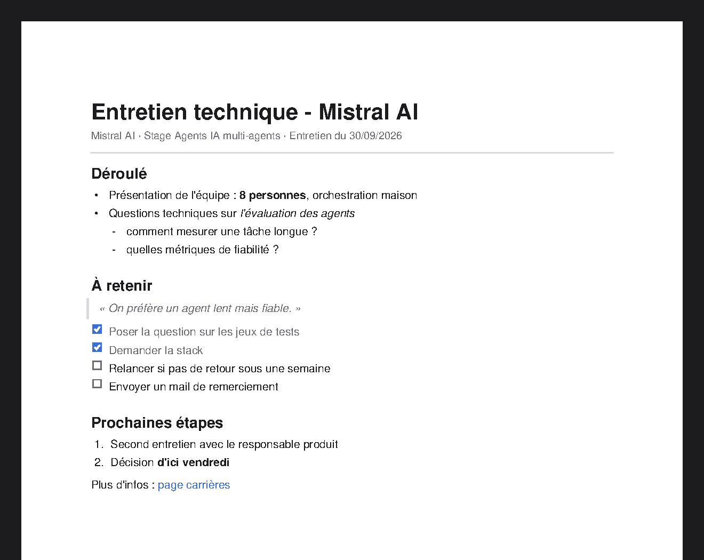</p>

### CV

Une section pour **tes CV** - le français, l'anglais, celui orienté data : le **fichier** (à télécharger, à envoyer), son **texte** (à copier en un clic), et surtout **où il se modifie** : le dossier de ton projet LaTeX, ou ton fichier Word. Azimut n'y touche jamais, il garde juste le chemin (à copier, ou à ouvrir depuis l'appli). C'est ce qui permet à une IA de **lire le texte brut à jour** et de **savoir où aller le modifier** si tu le lui demandes. Le **CV principal** est celui qu'elle lit pour rédiger tes lettres et adapter tes fiches.

<p align="center"></p>

### Et aussi

- **Tableau de bord & statistiques** - entonnoir, délais, taux de réponse par source, courbe hebdomadaire, objectif hebdo.
- **Recherche globale** (<kbd>⌘K</kbd>) - candidatures, entreprises, notes, documents, lettres et fiches, textes compris.
- **Saisie assistée par IA** (optionnelle, tout fournisseur) - colle une offre, le formulaire se pré-remplit. Rien n'est écrit sans ta confirmation.
- **Sauvegarde complète et restauration** (Réglages, ci-dessous) : une seule archive `.zip` avec la base **et tous les fichiers** (documents, lettres, fiches, CV) - pour changer d'ordinateur ou se remettre d'un pépin. La restauration vérifie l'archive d'abord, n'écrase jamais un fichier et garde ton état précédent de côté.
- **Export/import Excel**, sauvegardes automatiques de la base (avant toute migration, une copie de sécurité est prise).
- **100 % local** - rien ne quitte ta machine, sauf export explicite ou activation de l'assistant IA.

Quelques extras (vue compagnon iPhone/iPad, capture rapide depuis Safari) sont détaillés dans [la doc complète](#docs).

<p align="center">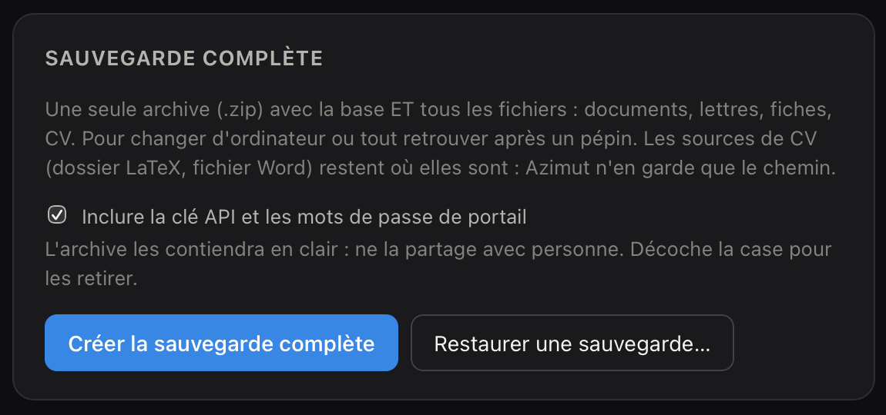</p>

## Les skills IA à télécharger

Un **skill** est une « recette » qu'on donne à une IA (Claude Code, Claude.ai…) pour qu'elle fasse une tâche précise toujours de la même façon. Azimut en propose deux, dans le dossier [`skills/`](skills/), **téléchargeables** :

| Skill | Ce qu'il fait | Télécharger |
| :--- | :--- | :--- |
| **`lettre-motivation`** | Rédige une lettre de motivation personnalisée à partir de ton CV et d'une offre, après une recherche approfondie sur l'entreprise, avec un style qui ne sonne pas « généré » (texte, ou lettre LaTeX complète dans un projet latex-forge). | [**lettre-motivation.skill**](https://github.com/thmsgo18/Azimut/raw/main/skills/lettre-motivation.skill) |
| **`fiche-entretien`** | Prépare une fiche d'entretien en PDF pour une ou plusieurs offres d'une même entreprise : présentation de l'entreprise, détail des postes (avec le lien de l'offre s'il est encore en ligne), questions à poser adaptées à ton profil. | [**fiche-entretien.skill**](https://github.com/thmsgo18/Azimut/raw/main/skills/fiche-entretien.skill) |

**Les utiliser :** télécharge le fichier `.skill` et importe-le dans ta liste de skills (Claude Code, Claude.ai…). Ensuite, demande simplement « fais-moi une lettre de motivation pour cette offre » ou « prépare-moi une fiche pour mon entretien chez X ». Ce sont les skills d'origine de l'auteur : ils fonctionnent seuls, sans Azimut, et mentionnent son contexte (prénom, projet latex-forge) - à adapter à ton usage.

**Pour que le résultat arrive directement dans Azimut**, chaque skill a son guide adapté au projet - [`skills/lettre-motivation/AGENT.md`](skills/lettre-motivation/AGENT.md) et [`skills/fiche-entretien/AGENT.md`](skills/fiche-entretien/AGENT.md) : mêmes règles de fond, mais l'IA lit ton CV et tes offres, et enregistre la lettre ou la fiche par la ligne de commande d'Azimut. Il suffit d'**ouvrir le dossier d'Azimut avec ton IA** : elle trouve ces guides toute seule (via [`AGENT.md`](AGENT.md) et [`CLAUDE.md`](CLAUDE.md)), **sans clé API**. La génération par clé API utilise le **même bloc de règles** : les deux chemins produisent le même travail. Détails dans [`skills/README.md`](skills/README.md).

## Ligne de commande & IA

Toutes les fonctions restent pilotables en ligne de commande :

```bash
./suivi candidatures ajouter --entreprise "AgentikCo" --poste "Stage agents IA" --statut Envoyée
./suivi candidatures lister --statut Envoyée
./suivi cv voir                     # le CV principal, et où se trouve sa source modifiable
```

Azimut fournit aussi tout ce dont une IA a besoin pour tenir la base à jour directement et sans risque - champs validés, doublons détectés, jamais de SQL brut : voir [`CLAUDE.md`](CLAUDE.md) (règles générales) et [`AGENT.md`](AGENT.md) (quel guide suivre : ajouter une offre, rédiger une lettre, préparer une fiche…).

## Docs

Le guide complet - référence CLI intégrale, API Python, automatisations macOS, comparatif avec un tableur, et les valeurs autorisées de chaque champ - vit dans [`README.full.fr.md`](docs/README.full.fr.md).

## Tests

```bash
./venv/bin/python -m unittest discover -s tests
```

## Contribuer

Signalements de bugs, corrections, traductions et nouvelles fonctionnalités bienvenus, voir [`CONTRIBUTING.md`](CONTRIBUTING.md).

## Sécurité

Un problème de sécurité à signaler ? Voir [`SECURITY.md`](SECURITY.md) pour savoir comment procéder.

## Licence

[MIT](LICENSE) - projet personnel, ouvert et librement réutilisable.
