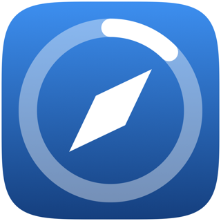
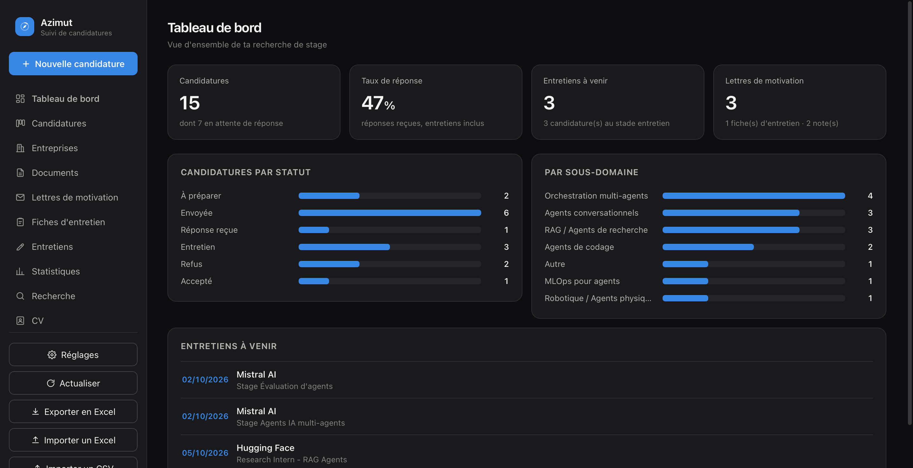
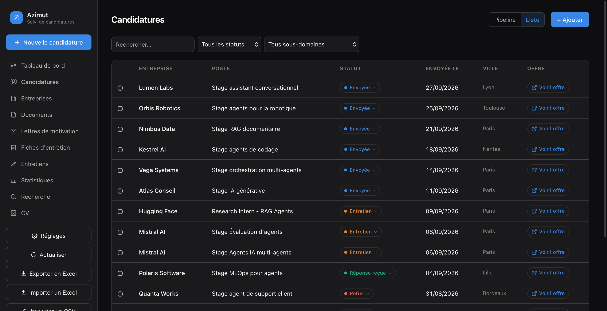
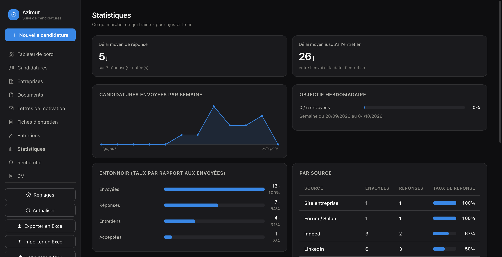

<p align="right"><b>English</b> | <a href="./README.fr.md">Français</a></p>

<div align="center">
  

  <h1>Azimut</h1>

  <p><b>Track your internship search in a real local database, behind a native desktop app - not another spreadsheet.</b></p>

  <p>
    <a href="https://github.com/thmsgo18/azimut/actions/workflows/tests.yml"></a>
    <a href="LICENSE"></a>
    
  </p>

  <p>
    <a href="#install">Install</a> •
    <a href="#features">Features</a> •
    <a href="#the-command-line--ai">CLI & AI</a> •
    <a href="#docs">Docs</a>
  </p>
</div>

---

Azimut centralizes an entire internship search - applications, companies, contacts, documents, interviews - in one local SQLite database, behind a clean interface that opens like any other desktop app. Built for an AI/ML master's student, but it makes no assumption about the field: it fits any internship or job search.

No account, no cloud, no subscription. Everything lives in one file on your machine.

<p align="center">
  
</p>

<table>
<tr>
<td width="50%"></td>
<td width="50%"></td>
</tr>
</table>

## Install

Needs [Python 3.10+](https://python.org) (on Windows, tick "Add python.exe to PATH" during install). [**Download the ZIP**](https://github.com/thmsgo18/azimut/archive/refs/heads/main.zip) or `git clone` this repo, then:

- **macOS** - double-click **`Azimut.app`**. Blocked the first time? Right-click → *Open*, once.
- **Windows** - double-click **`Azimut.bat`**.
- **Linux** - run `./azimut.sh`.

First launch installs everything by itself (one-time internet connection). Everything lives in one file, `suivi_candidatures.db`, created at the project root. Closing the window quits the app.

## Features

- **List & kanban pipeline** - filterable list view by default (one-click status change, direct link to the posting), or drag-and-drop kanban.
- **Companies & contacts** - linked to each application, with duplicate detection that catches "Mistral" vs "Mistral AI".
- **Dashboard & stats** - funnel, response rate by source, weekly chart, weekly goal.
- **Calendar** - month/2-week view, exports to Calendar (Mac), Google Calendar, or `.ics`.
- **Interview prep sheet** and a split-screen interview mode with live notes.
- **AI-assisted entry** (optional, any provider) - paste a job posting, it pre-fills the form. Nothing written without you confirming.
- **Excel export/import**, CSV import from LinkedIn/Indeed, automatic backups.
- **100% local** - nothing leaves your machine unless you explicitly export or turn on the AI assistant.

A few extras (Reminders app, iPhone companion view) are macOS-only and detailed in [the full docs](#docs).

## The command line & AI

Every feature is scriptable:

```bash
./suivi candidatures ajouter --entreprise "AgentikCo" --poste "Stage agents IA" --statut Envoyée
./suivi candidatures lister --statut Envoyée
```

Azimut also ships with everything an AI assistant needs to manage the database directly and safely - validated fields, duplicate detection, no raw SQL. See [`CLAUDE.md`](CLAUDE.md) and [`AGENT.md`](AGENT.md).

## Docs

The full guide - complete CLI reference, the Python API, macOS automations, comparison with a spreadsheet, and every field's allowed values - lives in [`README.full.md`](docs/README.full.md).

## Tests

```bash
./venv/bin/python -m unittest discover -s tests
```

## Contributing

Bug reports, fixes, translations, and features are welcome, see [`CONTRIBUTING.md`](CONTRIBUTING.md).

## Security

Found a security issue? See [`SECURITY.md`](SECURITY.md) for how to report it.

## License

[MIT](LICENSE) - personal project, open and freely reusable.
